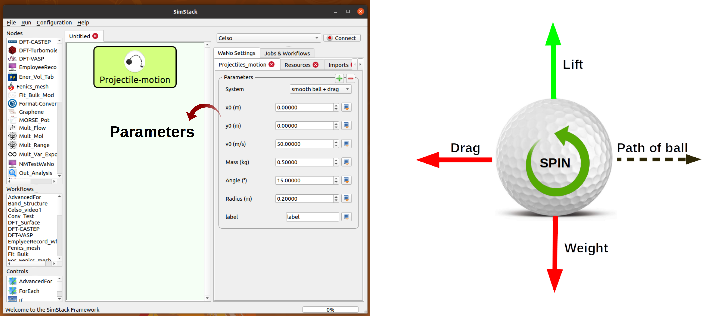

# Project: The Motion of a Golf Ball
---
authors: Celso R. C. Rêgo
---


Usually, people and especially students, have some issues with the concept that the only force acting upon an upward-moving projectile is gravity. Their conception of motion prompts them to think that if an object moves in a given direction, then there must be a force in that direction, e.g.,  if a particle is moving upward and rightward, there must be both an upward and rightward force. Probably, they believe it due to their intuition based on their daily lives, where the air-resistance, often termed drag, might not be negligible. In this project, we combine Python with __*Simstack*__ workflow framework to understand how we handle the projectile motions when drag effects are important.

Naturally, it is not complicated to add the drag force in the equations for a projectile motion, but solving them analytically for the position and velocity as functions of time can get a bit tricky. Fortunately, it is relatively easy to make precise and accurate numerical solutions using _Python_'s _Scipy_ library.

This project aims to show how the Projectile motion experienced by a Golf ball with mass $`M`$ $`(kg)`$ and radius $`r (m)`$ projected near the Earth's surface moves along a curved path under the action of gravity, $`g=9.81`$ $`(m/s^2)`$ when the effects of air-resistance and lift are assumed or neglected. Beyond the physics problems we aim to solve, we also want to highlight the __MultipleOf__ and __ForEach__ loop control features in the Simstack workflow framework. With only these features, we will submit several setups at once for a given simulation protocol, which might be computed in series using __*MultipleOf*__ or parallel with __ForEach__, and thus get the desired physical properties.

This tutorial demonstrates step-by-step through the Motion of a Golf ball project how to run and build simple and complex workflows. With these examples, we will learn how to iterate over parameter ranges using __ForEach__  loop control. Additionally, we explain how workflows may be branched through  _If_ loop control. The tutorial has a section with a breve introduction regards to physics of the problem. The remaining sections explore how to use **Simstack** features to understanding the nature of the problem.


### In this workflow, we will be able to:
```
1. Understanding the connection of acceleration due to gravity, range, maximum height, and trajectory properties of a projectile motion.
2. Determine the velocity of a particle at different points in its trajectory.
3. Apply the principle of independence of motion to solve projectile motion problems when the effects of air-resistance are assumed or neglected.
```
## Theoretical Solution
The proper way to modeling the Projectile Motion is to split it into two independent motions, i.e., horizontal (x) and vertical (y). 
The magnitudes of the components of the velocity $`V`$ are $`V_x = V cos(\theta)`$ and $`V_y = V sin(\theta)`$ where $`V`$ is the magnitude of the velocity and $`\theta`$ is its angle direction, as depicted in **Fig 1**. A golf ball's trajectory is affected directly by gravity, air resistance, and rotation (lift). We illustrate on the right of  **Fig 2** the forces acting on the ball. This project will explore four scenarios: a _smooth ball_, _smooth ball + drag_, _golf ball + drag_, and _golf ball + drag + lift_.


**Fig 1**  _The split of a projectile motion into two independent one-dimensional motions along the vertical and horizontal axes.
The horizontal range $`d`$ ( the blue line) is maximum distance traveled on the $`x`$ coodinate when it returns to its initial height ($`y=0`$)._

## 2D General Equations
    
$`F_x = - F^d_x + F^l_x`$

$`F_y = -F_g - F^d_x + F^l_y`$

$`F_g`$ is the force of gravity that acts at all times on all objects near Earth.

The drag force or air resistance $`F^d = \frac{1}{2}\rho_f A C_D|v|^2`$ refers to forces acting opposite to the relative motion of the ball moving concerning a surrounding fluid (air in this case). Here, $`C_D`$ is the drag coefficient, $`{\rho}`$ is the air density, $`{A}`$ represents the cross-sectional area  of the ball. The drag coefficient is not constant, it decreases as velocity increases.

$`F^l =  \frac{1}{2}\rho_f A C_L|v|^2 `$ is the lift force stemming from the rotation of the ball (the Magnus-effect) and is normal to $`v`$. With the given direction, the ball rotates counter-clockwise (backspin), where $`C_L`$ is the lift coefficient.


# Projectile-motion WaNo

The Workflow building blocks within the Simstack Workflow framework are composed of Workflow Active Nodes (WaNos), which are XML files combined with scripts defining the expected input and output. As pointed out above, we want to understand the physics of a Projectile motion accounting or not drag effects; for that, we built a WaNo as shown in **Fig 2**, where only the relevant parameters are exposed.    



**Fig 2** _On the left-hand side is depicted the Projectile_motion WaNo. Outlined in blue we expose the most relevant physical parameters of the projectile motion problem. On the right-hand side, we depict some of the possible forces acting on the golf ball._

## 1. Python Setup
To get this workflow up running on your available computational resources, make sure to have the below libraries installed on Python 3.6 or newer.

```
1. Numpy, os, sys, csv, yaml
2. scipy
3. matplotlib
```

## 2. Inputs parameters with **_MultipleOf_** feature

| Parameter | variable type    |
| ------------------------|-----|
| `System`      | _Boolean_ |
| `x0(m)`       | _Float_ |
| `y0(m)`       | _Float_ |
| `v0(m/s)`     | _Float_ |
| `Mass (kg)`   | _Float_ |
|`Angle(°)`     | _Float_ |
|`Radius(m)`    | _Float_ |
|`label`        |_String_ |

The list above displays the Projectile_motion **WaNo** parameters with the respective variable types and physical units. Here, $`x_0`$ and $`y_0`$ are the initial positions of the projectile in the horizontal and vertical axes. $`v_0`$ is the initial velocity. $`Mass`$ is the ball's mass with a given Radius, and the label variable is a string to assign the chosen set of the variables. The _System_ flag adds the desired scenario, and the equations of motion are solved numerically using the _solve_ip_ from_ scipy_ library.

The set of the exposed parameters in this **WaNo** allows us to change the python script's inputs embedded on it. Based on the  _**WaNoDropDown**_ and _**MultipleOf**_ features, this interface may submit many serial tasks at once, as shown on the evaluated three initial angle values on the right-hand side of **Fig 2**. The outcomes follow the numerical solutions for the projectile motion within the chosen scenario.

## 3. Outputs
This **WaNo** will generate  ``` PROJOUT.yml``` and ```PROJDATA.yml``` files. The table below shows the keys contained in each one, and later on, we will use these keys to inquire about their values.

| PROJOUT.yml | PROJDATA.yml    |
| ------------------------|-----|
| `xmax` maximum range    | `x` position |
| `ymax` maximum height   | `y` position |
| `time to target`        | `vx` velocity|
| `time to highest point` | `vy` velocity|
| `Step ii` label         |     |

## 4. Auxiliary WaNos
The set of Auxiliary **WaNos** will be extensively used and reused in all upcoming workflows. They will be responsible for managing some worflow data. As shown in **Fig 3**, ```Range-It```, ```Plot-Figures``` and ```Table-Generator```, will be used to pass a variable at the beginning of the workflow, inquire variables of a loaded file, and plot figures. 

```Range-It``` creates a Float or integer list, which will pass to the Projectile-motion **WaNo** inside the **_ForEach_** loop control, explained in the next step. 

The ```Table-Generator``` **WaNo** generates table files in a ```csv``` and ```yml``` formats for a given set of variables inquired from a loaded file. 

The ```Plot-Figures``` **WaNo** will make a plot of the inquired data. This **WaNo** allows us to switch between _Same-graph_ (plot several curves in the same figure) and  _Subplot_ modes (plot each curve in a different subplot ).     


**Fig 3** The upper two panels exhibit the _Float_ and _Int_ modes available on the Range-It **WaNo**. The below two panels display the _Same-graph_ and Subplot modes. Each mode in this **WaNo** allows us to inquire about the variables from Projectile-motion and plot them. 

The outputs of the **WaNo** ```Plot-Figures``` in **Fig 3** might be _Plot-Figure.png _ and _Plot-subplot.png_ . Click on **Fig 3** to see more details about their inputs.

## 5. Workflow with ```Projectile-motion``` and ```Plot-Figures``` **WaNos**


**Fig 4** _The workflow above is composed of _Projectile-motion_, and _Plot-Figures_ **WaNos**. Step 3 shows the figure as one of the possible outputs of this workflow._

**Fig 4** shows the workflow named as _Proj-motion_, which compares the drag effect acting on a smooth ball.

#### Running this Workflow   
- 1. Drag and drop the _Proj-motion_ **WaNo** from the top left menu to the SimStack canvas as pointed by the blue arrow on panel **Step 1** in **Fig 4**.
- 2. In this case, we set the Angle parameter to `25(°)` for two different System scenarios (_smooth ball_ and _smooth ball + drag_ ), we kept the other parameters as their default values.
- 3. Repeat Step 1 for auxiliary _Plot-Figures_ **WaNo** connecting it below the _Proj-motion_. Load the ```PROJOUT.yml``` file field in the _Input-File_ field, then click on the option _Same-graph_, the click will trigger the options to be filled. In this case, you should set the title, labels, and variables (data), which will show up in the output figure.  
- 4. Name your workflow with `Ctrl+S`, and running it with `Ctrl+R` command.
- 5. The **Step 3** of **Fig 4** shows that by choosing the ```Browser Directory``` with a double click in the green folder (Jobs & Workflows tab) of the workflow, you will be able to click on _Plot-Figure.png_ and see the figure comparing the _x_ and _y_ coordinates of the smooth ball under or not of air resistance effect.

## 6. A slightly complex workflow using the **ForEach** feature  
In this **Workflow**, we want to explore the scenario where the system under study has multiples initial velocity (```v_0```) values, and we want to investigate the dependence of maximum height ```ymax``` and _time to target_ variables in terms of maximum range ```xmax```. For this example, the chosen system is _golf ball + drag + lift_.


**Fig 5** shows the workflow, a workflow composed of four **WaNos** and the **ForEach** loop control. The blue arrows refer to the input parameters of each **WaNo**. The red arrow in **Step 1** shows how to fill the field responsible for passing the list of values from ```Range-It``` **WaNo** to the **ForEach**. The red arrow in **Step 3** points out the assignment of the _ForEach_Iterator_ to the initial velocity (```v_0```) variable. The red arrow in **Step 5** shows the path to import all the files ```PROJOUT.yml``` of each initial velocity value. The last red arrow in **Step 6** indicates the tab where we must browser to access the _Plot-subplot.png_ figure.   

#### Running this Workflow   
- 1. Drag and drop the _Range-It_ **WaNo** from the top left menu to the SimStack canvas as pointed by the blue arrow on panel **Step 1** in **Fig 5**. There are 20 different values for initial velocity in this scenario, varying from 20 to 70 (m/s).

- 2. Drag and drop the _ForEach_ loop control from below right and insert the _Projectila-motion_ **WaNo** inside it. In the sequence, assign the ``` ${ForEach_Iterator}``` according to the **Step 3** of **Fig 5**.

- 3. Drag and drop the _Table-Generator_ **WaNo** from the top left menu to the SimStack below to _ForEach_ loop control. Fill up the fields of _Table-Generator_ as shown in **Step 4** of **Fig 5**. In this part, you also should import the files from where the information will be extracted, in this case ```PROJOUT.yml``` as depicted in **Step 5**.

- 4. Drag and drop the _Plot-Figures_ **WaNo** from the top left menu to the SimStack below to _Table-Generator_, click on the option _Subplot_. In this case, you should set the title, labels, and variables (data), which will show up in the output figure. Fill up the fields according to the **Step 6** of **Fig 5**.  

- 5. Name your workflow with `Ctrl+S`, and running it with `Ctrl+R` command.

- 6. The last step in **Fig 5** shows that by choosing the ```Browser Directory``` with a double click in the green folder (Jobs & Workflows tab) of the workflow, you will be able to click on _Plot-subplot.png_ and see the subplots comparing the dependence of maximum height ```ymax``` and _time to target_ variables in terms of maximum range ```xmax```.

## 7. Branched Workflows using the **If** feature

This part will explain how to preventing unphysical results using the **If** loop control, which essentially branches the workflow. In the Projectile-motion **WaNo** the options `golf ball + drag` and `golf ball + drag + lift` in the `System` field are only valid for initial velocities `v0(m/s)` between 13.7 and 88.1 m/s. This constraint occurs due to the dependence of the drag and lift coefficients, which are functions of the initial velocities and spin of the golf ball, as pointed out in the beginning. In this case, we are keeping the spin constant. Then only the velocity will be considered.


**Fig 6** shows a branched workflow, which prevents unphysical results for a specific variable. The black arrows in both steps point from the variable `val_v0` value to two different scenarios inside the **If** loop control.

**Fig 6** exhibits the outcomes from this example. The workflow left, and the right sides display the two possible scenarios for this case. Runs the workflow composed by the _Projectile-motion_ and _Plot-Figures_ or runs Stop **WaNo**, which prints out a message on the `Stop-msg` file.

#### Running this Workflow

- 1. Drag and drop the _Variable_ control from the bottom left menu to the SimStack canvas and setup it as shows **Fig 6**.

- 2. Drag and drop the _If_ control bottom left menu and insert on the left-hand side the workflow composed by the _Projectila-motion_ and Plot-Figures **WaNos**. Next, we make the appropriate setup for them. If this part is true, it must generate the expected output files for each **WaNo** as explained in section **5**.

- 3. Drag and drop the auxiliary _Stop_ **WaNo** from the bottom left menu inside the right side of the _If_ loop control. If this part is true, it must generate the `Stop-msg` file. 
 
- 5. Name your workflow with `Ctrl+S`, and running it with `Ctrl+R` command.

- 6. A double click in the green folder (Jobs & Workflows tab) of the workflow will allow us to check the outputs according to the chosen _if_ condition.

## Final Remarks

Running this project within Simstack saves time, and we avoid adding more code lines to our python script. For instance, to get the figure in **Step 6**, we would have to add a _for_ loop in the python script to be executed in a serial version, unless you want to make an additional effort to parallelize this task. On the other hand, **Simstack** promptly runs it in parallel in the available computational resources.


