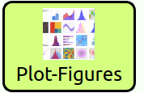
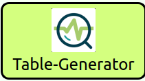
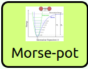

## Downloading WaNos

Here are a list of WaNo resources.

  * <a href="http://www.simstack.de/nanomatch-files/kit_tutorial/static_files/Plot-Figures.xz">Plot-Figures</a>
  * <a href="http://www.simstack.de/nanomatch-files/kit_tutorial/static_files/Table-Generator.xz">Table-Generator</a>
  * <a href="http://www.simstack.de/nanomatch-files/kit_tutorial/static_files/Range-It.xz">Range-It</a>
  * <a href="http://www.simstack.de/nanomatch-files/kit_tutorial/static_files/Stop.xz">Stop</a>
  * <a href="http://www.simstack.de/nanomatch-files/kit_tutorial/static_files/Q-ESPRESSO.xz">Q-ESPRESSO</a>
  * <a href="http://www.simstack.de/nanomatch-files/kit_tutorial/static_files/Morse-pot.xz">Morse-pot</a>
  * <a href="http://www.simstack.de/nanomatch-files/kit_tutorial/static_files/Projectile-motion.xz">Projectile-motion</a>

### Plot-Figures
This **WaNo** will make a plot of the inquired data. It allows us to switch between Same-graph 
(plot several curves in the same figure) and Subplot modes (plot each curve in a different subplot ).

### Table-Generator
This **WaNo** generates table files in a `csv` and `yml` formats for a given set of variables inquired from a loaded file.

### Range-It
This **WaNo**  creates a Float or integer list in a `yml` file with a customized range of data.

### Stop
This **WaNo** prints a stop message.

### Q-ESPRESSO
This **WaNo** perform a DFT calculation using Qquatum Espresso code. Here the PW projectors are 
generated automatically after the specification of the chemical species.

### Morse-pot

This **WaNo** returns Morse potential in Ry as a function of the intermolecular distance between two Hydrogens atoms.

### Projectile-motion

This WaNo performs a DFT calculation for a given nuclear configuration.

