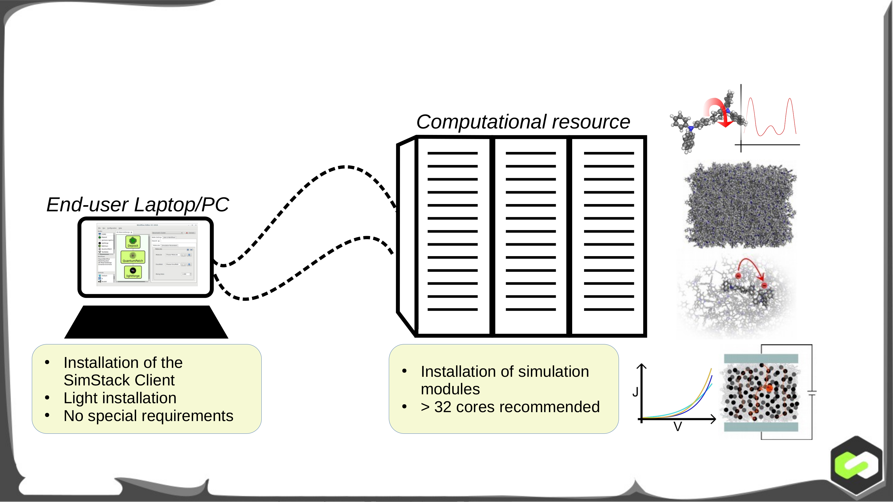

## Simstack-Documentation
Understanding the nature of the materials from a computation simulation perspective evolves fields that bring together knowledge from physics, materials science, chemistry, mechanical engineering, mathematics, and computer science. While new simulation methods are time-consuming and require in-depth knowledge about the physical/chemical ideas, a few key parameters typically suffice to transfer an established protocol from pre-existing code with a given method to a slightly different problem. However, this transfer is often not accounted for during the development phase. SimStack reduces the time-consuming workflow setup and hides the complexity of high-performance computing on remote resources enabling users in the academy or industry to incorporate competitive edge models and scalable scientific simulations into their simulation solutions.

This tutorial will be bridging the workflow philosophy using the SimStack framework to take advantage of the automation, reusability, reproducibility, and transferability concepts in simulation protocols and techniques.SimStack enables rapid prototyping of complex multiscale workflows for materials design. This is enabled by the following key features:

* New modules from any source (academic or commercial) can be incorporated within minutes, without any advanced knowledge in coding or scripting. A GUI is automatically generated when a new module is incorporated. 

* Development and adaption of simulation workflows via drag and drop, with simulation parameters and files automatically transferred between individual modules upon execution.
* One-click execution on remote resources and convenient job-monitoring via the special client-server setup hides the complexity of ```ssh```-access for workflow developers and end-users.

### SimStack Setup and incorporation of new modules


**Fig 1**  The principle of SimStack is a client-server configuration, es illustrated above. To use SimStack and incorporate new modules, proceed as follows:

1. Make the Simstack server available at the remote machine, usually HPC, institute clusters.

2. Install the SimStack client locally on your Laptop/Desktop PC. The client is available [here](https://www.nanomatch.de/nanomatch-files/software/simstack/current_release/)

3. To incorporate a new module, you need to create Workflow active Node (WaNo) for your module. These WaNos, i.e. the workflow building blocks, are XML files combined with scripts defining the execution command, expected input and output, along with essential adjustable parameters. 

<!-- To get started, we recommend to Download a default WaNo from App Store and customize for your specific simulation, and add it to the SimStack Client. When loaded into SimStack, a GUI is automatically generated based on the XML file. Therefore no expertise in programming or scription is required to incorporate modules into SimStack.  -->

### Rapid prototyping of workflows in the SimStack Client
Using the SimStack client (picture below), simulation workflows are constructed by dragging and dropping various (already incorporated modules) from the window on the top left into the main panel. Double click each module to modify module-specific parameters and allocate resources for each module. 
To reuse your workflow at a later stage, press ```Crtl+S``` or ```File -> Save```. It will then appear in the bottom left panel and can be re-loaded by double-clicking. To submit your workflow, connect to the computational resource (buttom in the top right) and click ```Run -> Run``` on the menu bar, or ```Crtl + r```. All required input files are uploaded automatically to the computational resource and workflow modules are executed serially or in parallel, depending on your workflow setup. Once the workflow is finished, you can use the SimStack Client to automatically retrieve reports of your workflow.


In this tutorial's we will demonstrate the SimStack concept using set of predefined WaNos. We will introduce the setup of WaNos and construct simple workflow cases using SimStack to illustrate reusability, reproducibility, and transferability of simulation protocols.

This tutorial consists of the following sections:

*  [SimStack Client Setup](tutorial/setup.md)
*  [Projectile Motion: The Motion of a Golf Ball](tutorial/Projectile_motion.md)
*  [Incorprating a new WaNo(MORSE potential)](tutorial/incorprating-a-new-wano.md)
*  [Downloading WaNos](tutorial/download.md)
